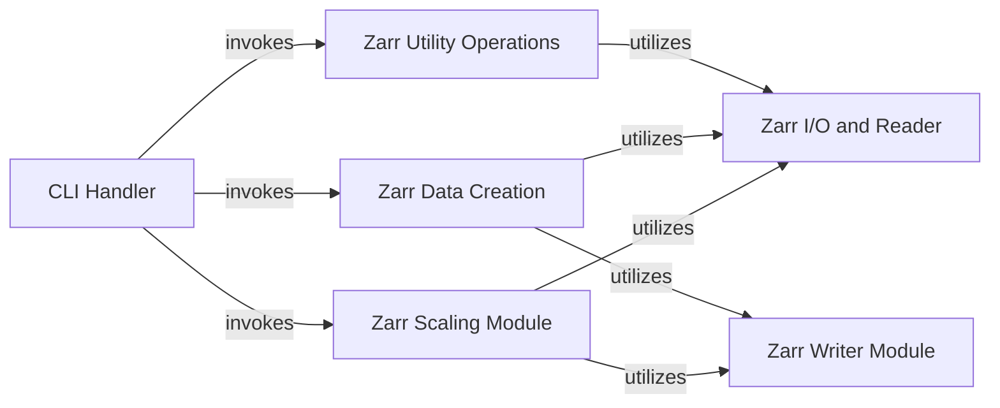

## Component Details

This subsystem provides command-line utilities for interacting with OME-Zarr datasets and a collection of general-purpose helper functions. The main flow involves the CLI Handler parsing user commands and dispatching them to various specialized components such as Zarr Utility Operations for data inspection and retrieval, Zarr Data Creation for generating new datasets, and Zarr Scaling Module for image resolution management. These components, in turn, rely on Zarr I/O and Reader for data access and Zarr Writer Module for persisting data.

### CLI Handler

This component serves as the command-line interface for the ome-zarr-py library. It parses command-line arguments, configures logging, and dispatches calls to the appropriate core functionalities based on the user's command (e.g., info, view, download, create, scale, csv_to_labels).

**Related Classes/Methods**:

- <a href="https://github.com/ome/ome-zarr-py/blob/master/ome_zarr/cli.py#L27-L30" target="_blank" rel="noopener noreferrer">`ome_zarr.cli.info` (27:30)</a>

- <a href="https://github.com/ome/ome-zarr-py/blob/master/ome_zarr/cli.py#L33-L36" target="_blank" rel="noopener noreferrer">`ome_zarr.cli.view` (33:36)</a>

- <a href="https://github.com/ome/ome-zarr-py/blob/master/ome_zarr/cli.py#L39-L42" target="_blank" rel="noopener noreferrer">`ome_zarr.cli.finder` (39:42)</a>

- <a href="https://github.com/ome/ome-zarr-py/blob/master/ome_zarr/cli.py#L45-L48" target="_blank" rel="noopener noreferrer">`ome_zarr.cli.download` (45:48)</a>

- <a href="https://github.com/ome/ome-zarr-py/blob/master/ome_zarr/cli.py#L51-L65" target="_blank" rel="noopener noreferrer">`ome_zarr.cli.create` (51:65)</a>

- <a href="https://github.com/ome/ome-zarr-py/blob/master/ome_zarr/cli.py#L68-L78" target="_blank" rel="noopener noreferrer">`ome_zarr.cli.scale` (68:78)</a>

- <a href="https://github.com/ome/ome-zarr-py/blob/master/ome_zarr/cli.py#L81-L86" target="_blank" rel="noopener noreferrer">`ome_zarr.cli.csv_to_labels` (81:86)</a>

- <a href="https://github.com/ome/ome-zarr-py/blob/master/ome_zarr/cli.py#L89-L204" target="_blank" rel="noopener noreferrer">`ome_zarr.cli.main` (89:204)</a>

- <a href="https://github.com/ome/ome-zarr-py/blob/master/ome_zarr/cli.py#L15-L24" target="_blank" rel="noopener noreferrer">`ome_zarr.cli.config_logging` (15:24)</a>

### Zarr Utility Operations

This component provides a collection of general utility functions for interacting with OME-Zarr data. It includes functionalities for retrieving information about Zarr arrays, viewing data, finding specific elements, and downloading Zarr datasets, often by leveraging I/O and reader capabilities.

**Related Classes/Methods**:

- <a href="https://github.com/ome/ome-zarr-py/blob/master/ome_zarr/utils.py#L30-L66" target="_blank" rel="noopener noreferrer">`ome_zarr.utils.info` (30:66)</a>

- <a href="https://github.com/ome/ome-zarr-py/blob/master/ome_zarr/utils.py#L69-L114" target="_blank" rel="noopener noreferrer">`ome_zarr.utils.view` (69:114)</a>

- <a href="https://github.com/ome/ome-zarr-py/blob/master/ome_zarr/utils.py#L193-L291" target="_blank" rel="noopener noreferrer">`ome_zarr.utils.finder` (193:291)</a>

- <a href="https://github.com/ome/ome-zarr-py/blob/master/ome_zarr/utils.py#L294-L347" target="_blank" rel="noopener noreferrer">`ome_zarr.utils.download` (294:347)</a>

- <a href="https://github.com/ome/ome-zarr-py/blob/master/ome_zarr/utils.py#L117-L173" target="_blank" rel="noopener noreferrer">`ome_zarr.utils.find_multiscales` (117:173)</a>

- <a href="https://github.com/ome/ome-zarr-py/blob/master/ome_zarr/utils.py#L209-L219" target="_blank" rel="noopener noreferrer">`ome_zarr.utils.finder.walk` (209:219)</a>

- <a href="https://github.com/ome/ome-zarr-py/blob/master/ome_zarr/utils.py#L176-L190" target="_blank" rel="noopener noreferrer">`ome_zarr.utils.splitall` (176:190)</a>

- <a href="https://github.com/ome/ome-zarr-py/blob/master/ome_zarr/utils.py#L350-L382" target="_blank" rel="noopener noreferrer">`ome_zarr.utils.strip_common_prefix` (350:382)</a>

### Zarr Data Creation

This component is responsible for the creation of new OME-Zarr data structures. It includes functions for generating sample Zarr arrays and converting data from external formats, such as CSV files, into the OME-Zarr specification.

**Related Classes/Methods**:

- <a href="https://github.com/ome/ome-zarr-py/blob/master/ome_zarr/data.py#L119-L223" target="_blank" rel="noopener noreferrer">`ome_zarr.data.create_zarr` (119:223)</a>

- <a href="https://github.com/ome/ome-zarr-py/blob/master/ome_zarr/csv.py#L29-L87" target="_blank" rel="noopener noreferrer">`ome_zarr.csv.csv_to_zarr` (29:87)</a>

### Zarr Scaling Module

This component encapsulates the logic for scaling OME-Zarr images. It defines the 'Scaler' class, which provides methods for downscaling and managing different scaling algorithms, ensuring proper resolution levels for multi-scale image data.

**Related Classes/Methods**:

- <a href="https://github.com/ome/ome-zarr-py/blob/master/ome_zarr/scale.py#L10-L100" target="_blank" rel="noopener noreferrer">`ome_zarr.scale.Scaler` (10:100)</a>

- <a href="https://github.com/ome/ome-zarr-py/blob/master/ome_zarr/scale.py#L40-L100" target="_blank" rel="noopener noreferrer">`ome_zarr.scale.Scaler.scale` (40:100)</a>

- <a href="https://github.com/ome/ome-zarr-py/blob/master/ome_zarr/scale.py#L12-L37" target="_blank" rel="noopener noreferrer">`ome_zarr.scale.Scaler.methods` (12:37)</a>

### Zarr I/O and Reader

This component handles the fundamental input/output operations and reading of OME-Zarr data. It provides functionalities to parse URLs to locate Zarr stores and a 'Reader' class to interpret and access the contents of OME-Zarr datasets.

**Related Classes/Methods**:

- <a href="https://github.com/ome/ome-zarr-py/blob/master/ome_zarr/io.py#L10-L20" target="_blank" rel="noopener noreferrer">`ome_zarr.io.parse_url` (10:20)</a>

- <a href="https://github.com/ome/ome-zarr-py/blob/master/ome_zarr/reader.py#L609-L649" target="_blank" rel="noopener noreferrer">`ome_zarr.reader.Reader` (609:649)</a>

### Zarr Writer Module

This component is responsible for writing OME-Zarr data to disk, including handling multiscale metadata and validating various OME-Zarr specific structures like axes, well images, plate acquisitions, and datasets.

**Related Classes/Methods**:

- <a href="https://github.com/ome/ome-zarr-py/blob/master/ome_zarr/writer.py#L26-L63" target="_blank" rel="noopener noreferrer">`ome_zarr.writer._get_valid_axes` (26:63)</a>

- <a href="https://github.com/ome/ome-zarr-py/blob/master/ome_zarr/writer.py#L66-L89" target="_blank" rel="noopener noreferrer">`ome_zarr.writer._validate_well_images` (66:89)</a>

- <a href="https://github.com/ome/ome-zarr-py/blob/master/ome_zarr/writer.py#L92-L113" target="_blank" rel="noopener noreferrer">`ome_zarr.writer._validate_plate_acquisitions` (92:113)</a>

- <a href="https://github.com/ome/ome-zarr-py/blob/master/ome_zarr/writer.py#L116-L127" target="_blank" rel="noopener noreferrer">`ome_zarr.writer._validate_plate_rows_columns` (116:127)</a>

- <a href="https://github.com/ome/ome-zarr-py/blob/master/ome_zarr/writer.py#L130-L148" target="_blank" rel="noopener noreferrer">`ome_zarr.writer._validate_datasets` (130:148)</a>

- <a href="https://github.com/ome/ome-zarr-py/blob/master/ome_zarr/writer.py#L151-L170" target="_blank" rel="noopener noreferrer">`ome_zarr.writer._validate_plate_wells` (151:170)</a>

- <a href="https://github.com/ome/ome-zarr-py/blob/master/ome_zarr/writer.py#L173-L293" target="_blank" rel="noopener noreferrer">`ome_zarr.writer.write_multiscale` (173:293)</a>

### [FAQ](https://github.com/CodeBoarding/GeneratedOnBoardings/tree/main?tab=readme-ov-file#faq)