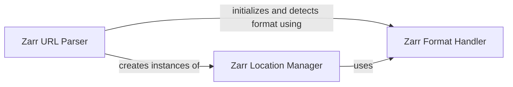

## Component Details

This component overview describes the core I/O and location management subsystem within the project. It focuses on how Zarr data locations are managed, how different OME-Zarr formats are handled, and how URLs are parsed to interact with Zarr stores. The main flow involves parsing a URL to obtain a ZarrLocation, which then uses format handlers to initialize and interact with the underlying Zarr store, abstracting the storage mechanism (local file system or HTTP).

### Zarr Location Manager

This component is responsible for managing Zarr data locations, including path resolution, initialization of the underlying store (FSStore), and handling metadata (.zarray, .zgroup, .zattrs). It provides methods for creating new locations, checking existence, and retrieving JSON metadata.

**Related Classes/Methods**:

- <a href="https://github.com/ome/ome-zarr-py/blob/master/ome_zarr/io.py#L20-L205" target="_blank" rel="noopener noreferrer">`ome_zarr.io.ZarrLocation` (20:205)</a>

- <a href="https://github.com/ome/ome-zarr-py/blob/master/ome_zarr/io.py#L29-L63" target="_blank" rel="noopener noreferrer">`ome_zarr.io.ZarrLocation.__init__` (29:63)</a>

- <a href="https://github.com/ome/ome-zarr-py/blob/master/ome_zarr/io.py#L65-L78" target="_blank" rel="noopener noreferrer">`ome_zarr.io.ZarrLocation.__init_metadata` (65:78)</a>

- <a href="https://github.com/ome/ome-zarr-py/blob/master/ome_zarr/io.py#L89-L91" target="_blank" rel="noopener noreferrer">`ome_zarr.io.ZarrLocation.exists` (89:91)</a>

- <a href="https://github.com/ome/ome-zarr-py/blob/master/ome_zarr/io.py#L141-L145" target="_blank" rel="noopener noreferrer">`ome_zarr.io.ZarrLocation.create` (141:145)</a>

- <a href="https://github.com/ome/ome-zarr-py/blob/master/ome_zarr/io.py#L147-L165" target="_blank" rel="noopener noreferrer">`ome_zarr.io.ZarrLocation.get_json` (147:165)</a>

- <a href="https://github.com/ome/ome-zarr-py/blob/master/ome_zarr/io.py#L190-L198" target="_blank" rel="noopener noreferrer">`ome_zarr.io.ZarrLocation._isfile` (190:198)</a>

- <a href="https://github.com/ome/ome-zarr-py/blob/master/ome_zarr/io.py#L200-L205" target="_blank" rel="noopener noreferrer">`ome_zarr.io.ZarrLocation._ishttp` (200:205)</a>

### Zarr Format Handler

This component manages different versions of the OME-Zarr format. It includes specific format implementations (like FormatV04 and FormatV02) and provides functionality to initialize the underlying store based on a given format, as well as to detect the format of existing Zarr data structures.

**Related Classes/Methods**:

- <a href="https://github.com/ome/ome-zarr-py/blob/master/ome_zarr/format.py#L220-L342" target="_blank" rel="noopener noreferrer">`ome_zarr.format.FormatV04` (220:342)</a>

- <a href="https://github.com/ome/ome-zarr-py/blob/master/ome_zarr/format.py#L173-L206" target="_blank" rel="noopener noreferrer">`ome_zarr.format.FormatV02` (173:206)</a>

- <a href="https://github.com/ome/ome-zarr-py/blob/master/ome_zarr/format.py#L182-L206" target="_blank" rel="noopener noreferrer">`ome_zarr.format.FormatV02.init_store` (182:206)</a>

- <a href="https://github.com/ome/ome-zarr-py/blob/master/ome_zarr/format.py#L33-L44" target="_blank" rel="noopener noreferrer">`ome_zarr.format.detect_format` (33:44)</a>

### Zarr URL Parser

This component provides utility functions for parsing URLs related to Zarr data. Its primary role is to convert a given URL into a ZarrLocation instance, serving as an entry point for external systems or users to interact with the Zarr I/O subsystem by providing a URL.

**Related Classes/Methods**:

- <a href="https://github.com/ome/ome-zarr-py/blob/master/ome_zarr/io.py#L208-L232" target="_blank" rel="noopener noreferrer">`ome_zarr.io.parse_url` (208:232)</a>

### [FAQ](https://github.com/CodeBoarding/GeneratedOnBoardings/tree/main?tab=readme-ov-file#faq)