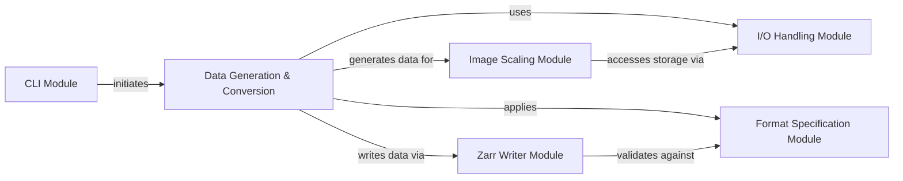

## Component Details

This architecture overview describes the core components of the ome-zarr-py library, focusing on its command-line interface, data generation and conversion capabilities, image scaling, Zarr writing, I/O handling, and format specification. The main flow involves the CLI initiating data operations, which then leverage data generation, conversion, scaling, and writing modules, all while adhering to the OME-Zarr format specifications and utilizing robust I/O utilities.

### CLI Module

This component provides the command-line interface for the ome-zarr-py library, allowing users to initiate Zarr creation and CSV to label conversions. It acts as the entry point for various high-level operations.

**Related Classes/Methods**:

- <a href="https://github.com/ome/ome-zarr-py/blob/master/ome_zarr/cli.py#L51-L65" target="_blank" rel="noopener noreferrer">`ome_zarr.cli.create` (51:65)</a>

- <a href="https://github.com/ome/ome-zarr-py/blob/master/ome_zarr/cli.py#L81-L86" target="_blank" rel="noopener noreferrer">`ome_zarr.cli.csv_to_labels` (81:86)</a>

- <a href="https://github.com/ome/ome-zarr-py/blob/master/ome_zarr/cli.py#L15-L24" target="_blank" rel="noopener noreferrer">`ome_zarr.cli.config_logging` (15:24)</a>

### Data Generation & Conversion

This component provides functionalities for generating sample OME-Zarr datasets (e.g., astronaut images, circles) for testing and demonstration, and utilities for converting external data formats, specifically CSV, into OME-Zarr labels. It also orchestrates the creation of Zarr archives from this data.

**Related Classes/Methods**:

- <a href="https://github.com/ome/ome-zarr-py/blob/master/ome_zarr/data.py#L47-L75" target="_blank" rel="noopener noreferrer">`ome_zarr.data.astronaut` (47:75)</a>

- <a href="https://github.com/ome/ome-zarr-py/blob/master/ome_zarr/data.py#L119-L223" target="_blank" rel="noopener noreferrer">`ome_zarr.data.create_zarr` (119:223)</a>

- <a href="https://github.com/ome/ome-zarr-py/blob/master/ome_zarr/data.py#L22-L44" target="_blank" rel="noopener noreferrer">`ome_zarr.data.coins` (22:44)</a>

- <a href="https://github.com/ome/ome-zarr-py/blob/master/ome_zarr/data.py#L78-L102" target="_blank" rel="noopener noreferrer">`ome_zarr.data.make_circle` (78:102)</a>

- <a href="https://github.com/ome/ome-zarr-py/blob/master/ome_zarr/data.py#L105-L116" target="_blank" rel="noopener noreferrer">`ome_zarr.data.rgb_to_5d` (105:116)</a>

- <a href="https://github.com/ome/ome-zarr-py/blob/master/ome_zarr/csv.py#L29-L87" target="_blank" rel="noopener noreferrer">`ome_zarr.csv.csv_to_zarr` (29:87)</a>

- <a href="https://github.com/ome/ome-zarr-py/blob/master/ome_zarr/csv.py#L14-L26" target="_blank" rel="noopener noreferrer">`ome_zarr.csv.parse_csv_value` (14:26)</a>

- <a href="https://github.com/ome/ome-zarr-py/blob/master/ome_zarr/csv.py#L90-L140" target="_blank" rel="noopener noreferrer">`ome_zarr.csv.dict_to_zarr` (90:140)</a>

### Image Scaling Module

This component provides functionalities for downsampling image data and generating image pyramids, which are essential for multiresolution OME-Zarr datasets. It includes different scaling methods like nearest-neighbor interpolation.

**Related Classes/Methods**:

- `ome_zarr.scale.Scaler` (full file reference)

- `ome_zarr.scale.Scaler.nearest` (full file reference)

### Zarr Writer Module

This component is dedicated to the actual writing of multiscale image data and associated metadata into a Zarr group. It handles the low-level details of data storage and Zarr array creation.

**Related Classes/Methods**:

- <a href="https://github.com/ome/ome-zarr-py/blob/master/ome_zarr/writer.py#L173-L293" target="_blank" rel="noopener noreferrer">`ome_zarr.writer.write_multiscale` (173:293)</a>

### I/O Handling Module

This component provides fundamental utilities for input/output operations, specifically for parsing URLs and managing Zarr storage locations. It ensures proper access and handling of Zarr directories.

**Related Classes/Methods**:

- `ome_zarr.io.parse_url` (full file reference)

### Format Specification Module

This component defines and validates the different versions of the OME-Zarr format, including the structure of metadata and coordinate transformations. It ensures compliance with the OME-NGFF specification.

**Related Classes/Methods**:

- <a href="https://github.com/ome/ome-zarr-py/blob/master/ome_zarr/format.py#L220-L342" target="_blank" rel="noopener noreferrer">`ome_zarr.format.FormatV04` (220:342)</a>

### [FAQ](https://github.com/CodeBoarding/GeneratedOnBoardings/tree/main?tab=readme-ov-file#faq)