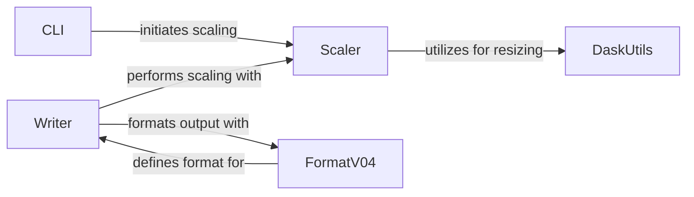

## Component Details

This graph illustrates the core components and their interactions within the `Image Processing & Scaling` subsystem of OME-Zarr. The primary flow involves the `CLI` initiating scaling operations, which are then handled by the `Scaler` component. The `Writer` component orchestrates the writing of scaled data, leveraging the `Scaler` for the actual scaling and `FormatV04` for ensuring adherence to the OME-Zarr specification. `DaskUtils` provides the underlying Dask array resizing capabilities used by the `Scaler`.

### Scaler

This component is responsible for performing various types of image downsampling (scaling) using different methods like nearest-neighbor, gaussian, laplacian, local mean, and zoom. It handles the creation of downsampled image pyramids and manages the Zarr store for output.

**Related Classes/Methods**:

- <a href="https://github.com/ome/ome-zarr-py/blob/master/ome_zarr/scale.py#L34-L289" target="_blank" rel="noopener noreferrer">`ome_zarr.scale.Scaler` (34:289)</a>

- <a href="https://github.com/ome/ome-zarr-py/blob/master/ome_zarr/scale.py#L93-L108" target="_blank" rel="noopener noreferrer">`ome_zarr.scale.Scaler.scale` (93:108)</a>

- <a href="https://github.com/ome/ome-zarr-py/blob/master/ome_zarr/scale.py#L179-L183" target="_blank" rel="noopener noreferrer">`ome_zarr.scale.Scaler.nearest` (179:183)</a>

- <a href="https://github.com/ome/ome-zarr-py/blob/master/ome_zarr/scale.py#L155-L177" target="_blank" rel="noopener noreferrer">`ome_zarr.scale.Scaler.resize_image` (155:177)</a>

- <a href="https://github.com/ome/ome-zarr-py/blob/master/ome_zarr/scale.py#L185-L203" target="_blank" rel="noopener noreferrer">`ome_zarr.scale.Scaler.__nearest` (185:203)</a>

- <a href="https://github.com/ome/ome-zarr-py/blob/master/ome_zarr/scale.py#L118-L123" target="_blank" rel="noopener noreferrer">`ome_zarr.scale.Scaler.__check_store` (118:123)</a>

- <a href="https://github.com/ome/ome-zarr-py/blob/master/ome_zarr/scale.py#L125-L137" target="_blank" rel="noopener noreferrer">`ome_zarr.scale.Scaler.__assert_values` (125:137)</a>

- <a href="https://github.com/ome/ome-zarr-py/blob/master/ome_zarr/scale.py#L139-L153" target="_blank" rel="noopener noreferrer">`ome_zarr.scale.Scaler.__create_group` (139:153)</a>

- <a href="https://github.com/ome/ome-zarr-py/blob/master/ome_zarr/scale.py#L250-L288" target="_blank" rel="noopener noreferrer">`ome_zarr.scale.Scaler._by_plane` (250:288)</a>

### DaskUtils

This component provides utility functions for working with Dask arrays, specifically for resizing. It wraps skimage.transform.resize to handle Dask array specific operations like rechunking and block processing.

**Related Classes/Methods**:

- <a href="https://github.com/ome/ome-zarr-py/blob/master/ome_zarr/dask_utils.py#L10-L61" target="_blank" rel="noopener noreferrer">`ome_zarr.dask_utils.resize` (10:61)</a>

### Writer

This component is responsible for writing image and label data to the OME-Zarr format. It orchestrates the scaling process by interacting with the Scaler component and handles metadata generation and validation using the FormatV04 component.

**Related Classes/Methods**:

- <a href="https://github.com/ome/ome-zarr-py/blob/master/ome_zarr/writer.py#L447-L537" target="_blank" rel="noopener noreferrer">`ome_zarr.writer.write_image` (447:537)</a>

- <a href="https://github.com/ome/ome-zarr-py/blob/master/ome_zarr/writer.py#L553-L649" target="_blank" rel="noopener noreferrer">`ome_zarr.writer._write_dask_image` (553:649)</a>

- <a href="https://github.com/ome/ome-zarr-py/blob/master/ome_zarr/writer.py#L787-L895" target="_blank" rel="noopener noreferrer">`ome_zarr.writer.write_labels` (787:895)</a>

- <a href="https://github.com/ome/ome-zarr-py/blob/master/ome_zarr/writer.py#L898-L933" target="_blank" rel="noopener noreferrer">`ome_zarr.writer._create_mip` (898:933)</a>

- <a href="https://github.com/ome/ome-zarr-py/blob/master/ome_zarr/writer.py#L173-L293" target="_blank" rel="noopener noreferrer">`ome_zarr.writer.write_multiscale` (173:293)</a>

- <a href="https://github.com/ome/ome-zarr-py/blob/master/ome_zarr/writer.py#L652-L697" target="_blank" rel="noopener noreferrer">`ome_zarr.writer.write_label_metadata` (652:697)</a>

- <a href="https://github.com/ome/ome-zarr-py/blob/master/ome_zarr/writer.py#L26-L63" target="_blank" rel="noopener noreferrer">`ome_zarr.writer._get_valid_axes` (26:63)</a>

- <a href="https://github.com/ome/ome-zarr-py/blob/master/ome_zarr/writer.py#L540-L550" target="_blank" rel="noopener noreferrer">`ome_zarr.writer._resolve_storage_options` (540:550)</a>

- <a href="https://github.com/ome/ome-zarr-py/blob/master/ome_zarr/writer.py#L936-L951" target="_blank" rel="noopener noreferrer">`ome_zarr.writer._retuple` (936:951)</a>

- <a href="https://github.com/ome/ome-zarr-py/blob/master/ome_zarr/writer.py#L296-L371" target="_blank" rel="noopener noreferrer">`ome_zarr.writer.write_multiscales_metadata` (296:371)</a>

### FormatV04

This component defines and validates the OME-Zarr format version 0.4. It provides functionalities for generating and validating coordinate transformations, which are crucial for correctly representing multiscale image data.

**Related Classes/Methods**:

- <a href="https://github.com/ome/ome-zarr-py/blob/master/ome_zarr/format.py#L220-L342" target="_blank" rel="noopener noreferrer">`ome_zarr.format.FormatV04` (220:342)</a>

- <a href="https://github.com/ome/ome-zarr-py/blob/master/ome_zarr/format.py#L260-L271" target="_blank" rel="noopener noreferrer">`ome_zarr.format.FormatV04.generate_coordinate_transformations` (260:271)</a>

- <a href="https://github.com/ome/ome-zarr-py/blob/master/ome_zarr/format.py#L273-L342" target="_blank" rel="noopener noreferrer">`ome_zarr.format.FormatV04.validate_coordinate_transformations` (273:342)</a>

### CLI

This component provides command-line interface functionalities, specifically for scaling operations. It acts as an entry point for users to interact with the scaling capabilities of the ome-zarr-py library.

**Related Classes/Methods**:

- <a href="https://github.com/ome/ome-zarr-py/blob/master/ome_zarr/cli.py#L68-L78" target="_blank" rel="noopener noreferrer">`ome_zarr.cli.scale` (68:78)</a>

### [FAQ](https://github.com/CodeBoarding/GeneratedOnBoardings/tree/main?tab=readme-ov-file#faq)