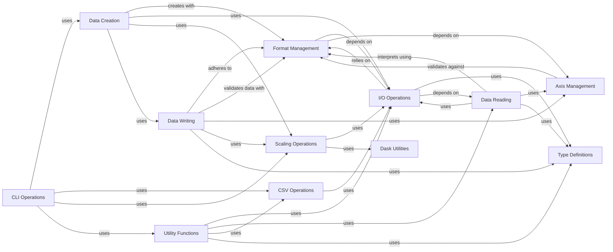

## Component Details

This subsystem is responsible for defining, managing, and interacting with the OME-Zarr format specifications. It encompasses functionalities for detecting format versions, validating metadata, generating format-specific structures, and handling core I/O operations for reading, writing, and creating OME-Zarr compliant data, including multiscale images and associated metadata. It also provides utilities for axis management, Dask integration for scaling, and command-line interfaces for various data operations.

### Format Management

This component defines and manages different versions of the OME-Zarr specification. It provides functionalities for detecting the format version of a Zarr store, validating metadata against specific format rules, and generating format-specific metadata structures like coordinate transformations and well dictionaries. It acts as a central hub for ensuring data compliance with OME-Zarr specifications.

**Related Classes/Methods**:

- <a href="https://github.com/ome/ome-zarr-py/blob/master/ome_zarr/format.py#L47-L117" target="_blank" rel="noopener noreferrer">`ome_zarr.format.Format` (47:117)</a>

- <a href="https://github.com/ome/ome-zarr-py/blob/master/ome_zarr/format.py#L120-L170" target="_blank" rel="noopener noreferrer">`ome_zarr.format.FormatV01` (120:170)</a>

- <a href="https://github.com/ome/ome-zarr-py/blob/master/ome_zarr/format.py#L173-L206" target="_blank" rel="noopener noreferrer">`ome_zarr.format.FormatV02` (173:206)</a>

- <a href="https://github.com/ome/ome-zarr-py/blob/master/ome_zarr/format.py#L209-L217" target="_blank" rel="noopener noreferrer">`ome_zarr.format.FormatV03` (209:217)</a>

- <a href="https://github.com/ome/ome-zarr-py/blob/master/ome_zarr/format.py#L220-L342" target="_blank" rel="noopener noreferrer">`ome_zarr.format.FormatV04` (220:342)</a>

- <a href="https://github.com/ome/ome-zarr-py/blob/master/ome_zarr/format.py#L33-L44" target="_blank" rel="noopener noreferrer">`ome_zarr.format.detect_format` (33:44)</a>

- <a href="https://github.com/ome/ome-zarr-py/blob/master/ome_zarr/format.py#L12-L20" target="_blank" rel="noopener noreferrer">`ome_zarr.format.format_from_version` (12:20)</a>

- <a href="https://github.com/ome/ome-zarr-py/blob/master/ome_zarr/format.py#L23-L30" target="_blank" rel="noopener noreferrer">`ome_zarr.format.format_implementations` (23:30)</a>

- <a href="https://github.com/ome/ome-zarr-py/blob/master/ome_zarr/format.py#L69-L84" target="_blank" rel="noopener noreferrer">`ome_zarr.format.Format._get_metadata_version` (69:84)</a>

- <a href="https://github.com/ome/ome-zarr-py/blob/master/ome_zarr/format.py#L131-L134" target="_blank" rel="noopener noreferrer">`ome_zarr.format.FormatV01.matches` (131:134)</a>

- <a href="https://github.com/ome/ome-zarr-py/blob/master/ome_zarr/format.py#L244-L258" target="_blank" rel="noopener noreferrer">`ome_zarr.format.FormatV04.validate_well_dict` (244:258)</a>

- <a href="https://github.com/ome/ome-zarr-py/blob/master/ome_zarr/format.py#L273-L342" target="_blank" rel="noopener noreferrer">`ome_zarr.format.FormatV04.validate_coordinate_transformations` (273:342)</a>

- <a href="https://github.com/ome/ome-zarr-py/blob/master/ome_zarr/format.py#L232-L242" target="_blank" rel="noopener noreferrer">`ome_zarr.format.FormatV04.generate_well_dict` (232:242)</a>

- <a href="https://github.com/ome/ome-zarr-py/blob/master/ome_zarr/format.py#L260-L271" target="_blank" rel="noopener noreferrer">`ome_zarr.format.FormatV04.generate_coordinate_transformations` (260:271)</a>

### I/O Operations

This component handles the fundamental input and output operations for OME-Zarr data, primarily focusing on initializing Zarr locations and parsing URLs to identify and access Zarr stores. It serves as the entry point for interacting with OME-Zarr datasets.

**Related Classes/Methods**:

- `ome_zarr.io.ZarrLocation` (full file reference)

- `ome_zarr.io.ZarrLocation.__init__` (full file reference)

- `ome_zarr.io.parse_url` (full file reference)

### Axis Management

The Axis Management component is responsible for defining and manipulating image axes within the OME-Zarr structure. It provides functionalities to initialize axis objects and convert them into list representations, ensuring proper dimensional handling for image data.

**Related Classes/Methods**:

- `ome_zarr.axes.Axes` (full file reference)

- `ome_zarr.axes.Axes.__init__` (full file reference)

- `ome_zarr.axes.Axes.to_list` (full file reference)

### Data Creation

This component is dedicated to the initial creation of Zarr data structures. It provides the core functionality to set up a new Zarr array, which serves as the foundation for storing OME-Zarr compliant image data.

**Related Classes/Methods**:

- <a href="https://github.com/ome/ome-zarr-py/blob/master/ome_zarr/data.py#L119-L223" target="_blank" rel="noopener noreferrer">`ome_zarr.data.create_zarr` (119:223)</a>

### Data Reading

The Data Reading component focuses on the retrieval and interpretation of existing OME-Zarr datasets, particularly multiscale images. It initializes structures for reading and accessing multiresolution image data, enabling efficient data consumption.

**Related Classes/Methods**:

- <a href="https://github.com/ome/ome-zarr-py/blob/master/ome_zarr/reader.py#L278-L320" target="_blank" rel="noopener noreferrer">`ome_zarr.reader.Multiscales.__init__` (278:320)</a>

- <a href="https://github.com/ome/ome-zarr-py/blob/master/ome_zarr/reader.py#L201-L266" target="_blank" rel="noopener noreferrer">`ome_zarr.reader.Label` (201:266)</a>

- <a href="https://github.com/ome/ome-zarr-py/blob/master/ome_zarr/reader.py#L182-L198" target="_blank" rel="noopener noreferrer">`ome_zarr.reader.Labels` (182:198)</a>

- <a href="https://github.com/ome/ome-zarr-py/blob/master/ome_zarr/reader.py#L327-L393" target="_blank" rel="noopener noreferrer">`ome_zarr.reader.OMERO` (327:393)</a>

- <a href="https://github.com/ome/ome-zarr-py/blob/master/ome_zarr/reader.py#L467-L561" target="_blank" rel="noopener noreferrer">`ome_zarr.reader.Plate` (467:561)</a>

- <a href="https://github.com/ome/ome-zarr-py/blob/master/ome_zarr/reader.py#L564-L606" target="_blank" rel="noopener noreferrer">`ome_zarr.reader.PlateLabels` (564:606)</a>

- <a href="https://github.com/ome/ome-zarr-py/blob/master/ome_zarr/reader.py#L396-L464" target="_blank" rel="noopener noreferrer">`ome_zarr.reader.Well` (396:464)</a>

- <a href="https://github.com/ome/ome-zarr-py/blob/master/ome_zarr/reader.py#L159-L179" target="_blank" rel="noopener noreferrer">`ome_zarr.reader.Spec` (159:179)</a>

- <a href="https://github.com/ome/ome-zarr-py/blob/master/ome_zarr/reader.py#L19-L156" target="_blank" rel="noopener noreferrer">`ome_zarr.reader.Node` (19:156)</a>

- <a href="https://github.com/ome/ome-zarr-py/blob/master/ome_zarr/reader.py#L609-L649" target="_blank" rel="noopener noreferrer">`ome_zarr.reader.Reader` (609:649)</a>

### Data Writing

This component manages all aspects of writing various types of data to the OME-Zarr format. It includes functions for validating data structures, writing multiscale images, and generating metadata for plates, wells, and labels, ensuring data is stored correctly according to OME-Zarr specifications.

**Related Classes/Methods**:

- <a href="https://github.com/ome/ome-zarr-py/blob/master/ome_zarr/writer.py#L26-L63" target="_blank" rel="noopener noreferrer">`ome_zarr.writer._get_valid_axes` (26:63)</a>

- <a href="https://github.com/ome/ome-zarr-py/blob/master/ome_zarr/writer.py#L66-L89" target="_blank" rel="noopener noreferrer">`ome_zarr.writer._validate_well_images` (66:89)</a>

- <a href="https://github.com/ome/ome-zarr-py/blob/master/ome_zarr/writer.py#L92-L113" target="_blank" rel="noopener noreferrer">`ome_zarr.writer._validate_plate_acquisitions` (92:113)</a>

- <a href="https://github.com/ome/ome-zarr-py/blob/master/ome_zarr/writer.py#L116-L127" target="_blank" rel="noopener noreferrer">`ome_zarr.writer._validate_plate_rows_columns` (116:127)</a>

- <a href="https://github.com/ome/ome-zarr-py/blob/master/ome_zarr/writer.py#L130-L148" target="_blank" rel="noopener noreferrer">`ome_zarr.writer._validate_datasets` (130:148)</a>

- <a href="https://github.com/ome/ome-zarr-py/blob/master/ome_zarr/writer.py#L151-L170" target="_blank" rel="noopener noreferrer">`ome_zarr.writer._validate_plate_wells` (151:170)</a>

- <a href="https://github.com/ome/ome-zarr-py/blob/master/ome_zarr/writer.py#L173-L293" target="_blank" rel="noopener noreferrer">`ome_zarr.writer.write_multiscale` (173:293)</a>

- <a href="https://github.com/ome/ome-zarr-py/blob/master/ome_zarr/writer.py#L296-L371" target="_blank" rel="noopener noreferrer">`ome_zarr.writer.write_multiscales_metadata` (296:371)</a>

- <a href="https://github.com/ome/ome-zarr-py/blob/master/ome_zarr/writer.py#L374-L419" target="_blank" rel="noopener noreferrer">`ome_zarr.writer.write_plate_metadata` (374:419)</a>

- <a href="https://github.com/ome/ome-zarr-py/blob/master/ome_zarr/writer.py#L422-L444" target="_blank" rel="noopener noreferrer">`ome_zarr.writer.write_well_metadata` (422:444)</a>

- <a href="https://github.com/ome/ome-zarr-py/blob/master/ome_zarr/writer.py#L447-L537" target="_blank" rel="noopener noreferrer">`ome_zarr.writer.write_image` (447:537)</a>

- <a href="https://github.com/ome/ome-zarr-py/blob/master/ome_zarr/writer.py#L553-L649" target="_blank" rel="noopener noreferrer">`ome_zarr.writer._write_dask_image` (553:649)</a>

- <a href="https://github.com/ome/ome-zarr-py/blob/master/ome_zarr/writer.py#L652-L697" target="_blank" rel="noopener noreferrer">`ome_zarr.writer.write_label_metadata` (652:697)</a>

- <a href="https://github.com/ome/ome-zarr-py/blob/master/ome_zarr/writer.py#L700-L784" target="_blank" rel="noopener noreferrer">`ome_zarr.writer.write_multiscale_labels` (700:784)</a>

- <a href="https://github.com/ome/ome-zarr-py/blob/master/ome_zarr/writer.py#L787-L895" target="_blank" rel="noopener noreferrer">`ome_zarr.writer.write_labels` (787:895)</a>

### CLI Operations

This component provides command-line interface functionalities for interacting with OME-Zarr data, including operations related to CSV, data handling, scaling, and general utilities.

**Related Classes/Methods**:

- `ome_zarr.cli` (full file reference)

### CSV Operations

This component handles operations related to CSV files within the OME-Zarr context, primarily interacting with I/O functionalities.

**Related Classes/Methods**:

- `ome_zarr.csv` (full file reference)

### Dask Utilities

This component provides utility functions specifically for Dask integration, primarily used by the Scaling Operations component for efficient data handling.

**Related Classes/Methods**:

- `ome_zarr.dask_utils` (full file reference)

### Scaling Operations

This component manages the scaling of OME-Zarr data, utilizing Dask utilities and I/O operations to handle multiresolution image data.

**Related Classes/Methods**:

- `ome_zarr.scale` (full file reference)

### Type Definitions

This component defines common data types and structures used across the OME-Zarr library, ensuring consistency and proper data representation.

**Related Classes/Methods**:

- `ome_zarr.types` (full file reference)

### Utility Functions

This component provides a collection of general utility functions that support various operations within the OME-Zarr library, including interactions with CSV, I/O, reader, and type definitions.

**Related Classes/Methods**:

- `ome_zarr.utils` (full file reference)

### [FAQ](https://github.com/CodeBoarding/GeneratedOnBoardings/tree/main?tab=readme-ov-file#faq)