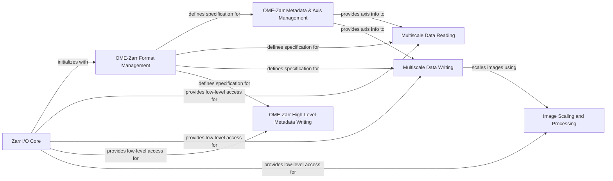

## Component Details

This system provides a comprehensive framework for managing OME-Zarr formatted biological image data. It encompasses low-level Zarr I/O operations, robust handling of OME-Zarr specification versions, precise management of image axes and metadata, and efficient reading and writing of multiscale image pyramids. Additionally, it includes utilities for image scaling and processing, ensuring data integrity and adherence to the OME-Zarr standard throughout the data lifecycle.

### Zarr I/O Core

This component is responsible for the fundamental interactions with Zarr stores, including initialization, reading, and writing of raw Zarr arrays and groups, and handling core OME-Zarr metadata files like .zarray, .zgroup, and .zattrs. It acts as the low-level interface to the Zarr storage.

**Related Classes/Methods**:

- <a href="https://github.com/ome/ome-zarr-py/blob/master/ome_zarr/io.py#L29-L63" target="_blank" rel="noopener noreferrer">`ome_zarr.io.ZarrLocation.__init__` (29:63)</a>

- <a href="https://github.com/ome/ome-zarr-py/blob/master/ome_zarr/io.py#L65-L78" target="_blank" rel="noopener noreferrer">`ome_zarr.io.ZarrLocation.__init_metadata` (65:78)</a>

- <a href="https://github.com/ome/ome-zarr-py/blob/master/ome_zarr/io.py#L147-L165" target="_blank" rel="noopener noreferrer">`ome_zarr.io.ZarrLocation.get_json` (147:165)</a>

### OME-Zarr Format Management

This component defines and manages different versions of the OME-Zarr specification. It provides mechanisms to detect the format version of existing Zarr data and offers specific validation and metadata generation functionalities tailored to each format version (e.g., V01, V02, V03, V04).

**Related Classes/Methods**:

- <a href="https://github.com/ome/ome-zarr-py/blob/master/ome_zarr/format.py#L120-L170" target="_blank" rel="noopener noreferrer">`ome_zarr.format.FormatV01` (120:170)</a>

- <a href="https://github.com/ome/ome-zarr-py/blob/master/ome_zarr/format.py#L173-L206" target="_blank" rel="noopener noreferrer">`ome_zarr.format.FormatV02` (173:206)</a>

- <a href="https://github.com/ome/ome-zarr-py/blob/master/ome_zarr/format.py#L209-L217" target="_blank" rel="noopener noreferrer">`ome_zarr.format.FormatV03` (209:217)</a>

- <a href="https://github.com/ome/ome-zarr-py/blob/master/ome_zarr/format.py#L220-L342" target="_blank" rel="noopener noreferrer">`ome_zarr.format.FormatV04` (220:342)</a>

- <a href="https://github.com/ome/ome-zarr-py/blob/master/ome_zarr/format.py#L33-L44" target="_blank" rel="noopener noreferrer">`ome_zarr.format.detect_format` (33:44)</a>

- <a href="https://github.com/ome/ome-zarr-py/blob/master/ome_zarr/format.py#L12-L20" target="_blank" rel="noopener noreferrer">`ome_zarr.format.format_from_version` (12:20)</a>

- <a href="https://github.com/ome/ome-zarr-py/blob/master/ome_zarr/format.py#L23-L30" target="_blank" rel="noopener noreferrer">`ome_zarr.format.format_implementations` (23:30)</a>

### OME-Zarr Metadata & Axis Management

Manages the internal representation, validation, and generation of OME-Zarr metadata structures, with a primary focus on image axes and coordinate transformations. It ensures that dimensional information and transformations adhere to the OME-Zarr specification, providing core utilities for axis definition, validation, and conversion.

**Related Classes/Methods**:

- <a href="https://github.com/ome/ome-zarr-py/blob/master/ome_zarr/axes.py#L12-L28" target="_blank" rel="noopener noreferrer">`ome_zarr.axes.Axes.__init__` (12:28)</a>

- <a href="https://github.com/ome/ome-zarr-py/blob/master/ome_zarr/axes.py#L30-L40" target="_blank" rel="noopener noreferrer">`ome_zarr.axes.Axes.validate` (30:40)</a>

- <a href="https://github.com/ome/ome-zarr-py/blob/master/ome_zarr/axes.py#L42-L47" target="_blank" rel="noopener noreferrer">`ome_zarr.axes.Axes.to_list` (42:47)</a>

- <a href="https://github.com/ome/ome-zarr-py/blob/master/ome_zarr/axes.py#L50-L61" target="_blank" rel="noopener noreferrer">`ome_zarr.axes.Axes._axes_to_dicts` (50:61)</a>

- <a href="https://github.com/ome/ome-zarr-py/blob/master/ome_zarr/axes.py#L98-L118" target="_blank" rel="noopener noreferrer">`ome_zarr.axes.Axes._validate_03` (98:118)</a>

- <a href="https://github.com/ome/ome-zarr-py/blob/master/ome_zarr/axes.py#L63-L87" target="_blank" rel="noopener noreferrer">`ome_zarr.axes.Axes._validate_axes_types` (63:87)</a>

### Multiscale Data Reading

This component focuses on reading and interpreting multiscale image data stored in the OME-Zarr format. It parses the multiscales metadata, identifies datasets at different resolutions, and prepares the data for consumption, often integrating with Dask arrays for lazy loading.

**Related Classes/Methods**:

- <a href="https://github.com/ome/ome-zarr-py/blob/master/ome_zarr/reader.py#L278-L320" target="_blank" rel="noopener noreferrer">`ome_zarr.reader.Multiscales.__init__` (278:320)</a>

- <a href="https://github.com/ome/ome-zarr-py/blob/master/ome_zarr/reader.py#L322-L324" target="_blank" rel="noopener noreferrer">`ome_zarr.reader.Multiscales.array` (322:324)</a>

### Multiscale Data Writing

This component provides the core functionality for writing multiscale image data, including pyramids and associated metadata, to an OME-Zarr store. It handles the organization of datasets, coordinate transformations, and ensures compliance with the OME-Zarr format specifications during the writing process.

**Related Classes/Methods**:

- <a href="https://github.com/ome/ome-zarr-py/blob/master/ome_zarr/writer.py#L173-L293" target="_blank" rel="noopener noreferrer">`ome_zarr.writer.write_multiscale` (173:293)</a>

- <a href="https://github.com/ome/ome-zarr-py/blob/master/ome_zarr/writer.py#L296-L371" target="_blank" rel="noopener noreferrer">`ome_zarr.writer.write_multiscales_metadata` (296:371)</a>

- <a href="https://github.com/ome/ome-zarr-py/blob/master/ome_zarr/writer.py#L553-L649" target="_blank" rel="noopener noreferrer">`ome_zarr.writer._write_dask_image` (553:649)</a>

- <a href="https://github.com/ome/ome-zarr-py/blob/master/ome_zarr/writer.py#L26-L63" target="_blank" rel="noopener noreferrer">`ome_zarr.writer._get_valid_axes` (26:63)</a>

- <a href="https://github.com/ome/ome-zarr-py/blob/master/ome_zarr/writer.py#L130-L148" target="_blank" rel="noopener noreferrer">`ome_zarr.writer._validate_datasets` (130:148)</a>

### OME-Zarr High-Level Metadata Writing

This component handles the writing of specific high-level OME-Zarr metadata structures, such as plate, well, and label metadata. It orchestrates the validation and generation of these complex metadata structures, often relying on the core OME-Zarr Format Management for format-specific rules.

**Related Classes/Methods**:

- <a href="https://github.com/ome/ome-zarr-py/blob/master/ome_zarr/writer.py#L374-L419" target="_blank" rel="noopener noreferrer">`ome_zarr.writer.write_plate_metadata` (374:419)</a>

- <a href="https://github.com/ome/ome-zarr-py/blob/master/ome_zarr/writer.py#L422-L444" target="_blank" rel="noopener noreferrer">`ome_zarr.writer.write_well_metadata` (422:444)</a>

- <a href="https://github.com/ome/ome-zarr-py/blob/master/ome_zarr/writer.py#L652-L697" target="_blank" rel="noopener noreferrer">`ome_zarr.writer.write_label_metadata` (652:697)</a>

- <a href="https://github.com/ome/ome-zarr-py/blob/master/ome_zarr/writer.py#L700-L784" target="_blank" rel="noopener noreferrer">`ome_zarr.writer.write_multiscale_labels` (700:784)</a>

- <a href="https://github.com/ome/ome-zarr-py/blob/master/ome_zarr/writer.py#L787-L895" target="_blank" rel="noopener noreferrer">`ome_zarr.writer.write_labels` (787:895)</a>

- <a href="https://github.com/ome/ome-zarr-py/blob/master/ome_zarr/writer.py#L92-L113" target="_blank" rel="noopener noreferrer">`ome_zarr.writer._validate_plate_acquisitions` (92:113)</a>

- <a href="https://github.com/ome/ome-zarr-py/blob/master/ome_zarr/writer.py#L116-L127" target="_blank" rel="noopener noreferrer">`ome_zarr.writer._validate_plate_rows_columns` (116:127)</a>

- <a href="https://github.com/ome/ome-zarr-py/blob/master/ome_zarr/writer.py#L151-L170" target="_blank" rel="noopener noreferrer">`ome_zarr.writer._validate_plate_wells` (151:170)</a>

- <a href="https://github.com/ome/ome-zarr-py/blob/master/ome_zarr/writer.py#L66-L89" target="_blank" rel="noopener noreferrer">`ome_zarr.writer._validate_well_images` (66:89)</a>

### Image Scaling and Processing

This component provides utilities for downsampling and resizing image data, which is crucial for generating multiscale pyramids. It encapsulates various scaling algorithms and handles the application of these transformations to image arrays, supporting both NumPy and Dask arrays.

**Related Classes/Methods**:

- `ome_zarr.scale.Scaler` (full file reference)

- `ome_zarr.scale.Scaler.resize_image` (full file reference)

- `ome_zarr.scale.Scaler.nearest` (full file reference)

- `ome_zarr.scale.Scaler.gaussian` (full file reference)

- `ome_zarr.scale.Scaler.laplacian` (full file reference)

- `ome_zarr.scale.Scaler.local_mean` (full file reference)

- `ome_zarr.scale.Scaler.zoom` (full file reference)

### [FAQ](https://github.com/CodeBoarding/GeneratedOnBoardings/tree/main?tab=readme-ov-file#faq)