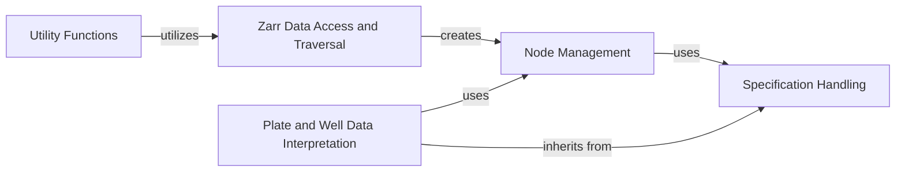

## Component Details

The OME-Zarr Reader subsystem is responsible for reading and interpreting the complex metadata and data structures within OME-Zarr datasets. It provides core functionalities for navigating the Zarr hierarchy, identifying different types of nodes (e.g., labels, multiscales, plates, wells), and accessing their associated data and metadata. This system abstracts the underlying Zarr storage, presenting a structured view of OME-Zarr compliant data.

### Node Management

This component is responsible for representing and managing individual elements within the OME-Zarr hierarchical data structure. It acts as a container (Node) for Zarr locations, associated metadata, and data arrays. It also manages the relationships between parent and child nodes, including their visibility and the application of relevant OME-Zarr specifications.

**Related Classes/Methods**:

- <a href="https://github.com/ome/ome-zarr-py/blob/master/ome_zarr/reader.py#L23-L61" target="_blank" rel="noopener noreferrer">`ome_zarr.reader.Node.__init__` (23:61)</a>

- <a href="https://github.com/ome/ome-zarr-py/blob/master/ome_zarr/reader.py#L110-L146" target="_blank" rel="noopener noreferrer">`ome_zarr.reader.Node.add` (110:146)</a>

- <a href="https://github.com/ome/ome-zarr-py/blob/master/ome_zarr/reader.py#L64-L66" target="_blank" rel="noopener noreferrer">`ome_zarr.reader.Node.first` (64:66)</a>

- <a href="https://github.com/ome/ome-zarr-py/blob/master/ome_zarr/reader.py#L80-L88" target="_blank" rel="noopener noreferrer">`ome_zarr.reader.Node.visible` (80:88)</a>

- <a href="https://github.com/ome/ome-zarr-py/blob/master/ome_zarr/reader.py#L104-L108" target="_blank" rel="noopener noreferrer">`ome_zarr.reader.Node.load` (104:108)</a>

- <a href="https://github.com/ome/ome-zarr-py/blob/master/ome_zarr/reader.py#L148-L150" target="_blank" rel="noopener noreferrer">`ome_zarr.reader.Node.write_metadata` (148:150)</a>

### Specification Handling

This component defines and implements the various OME-Zarr specifications (e.g., Labels, Multiscales, Plate, Well). It provides a mechanism to identify if a Zarr location conforms to a specific OME-Zarr structure and to extract relevant metadata and data based on these conventions. It acts as the base for interpreting the semantic meaning of different parts of an OME-Zarr dataset.

**Related Classes/Methods**:

- <a href="https://github.com/ome/ome-zarr-py/blob/master/ome_zarr/reader.py#L170-L176" target="_blank" rel="noopener noreferrer">`ome_zarr.reader.Spec.__init__` (170:176)</a>

- <a href="https://github.com/ome/ome-zarr-py/blob/master/ome_zarr/reader.py#L167-L168" target="_blank" rel="noopener noreferrer">`ome_zarr.reader.Spec.matches` (167:168)</a>

- <a href="https://github.com/ome/ome-zarr-py/blob/master/ome_zarr/reader.py#L178-L179" target="_blank" rel="noopener noreferrer">`ome_zarr.reader.Spec.lookup` (178:179)</a>

- <a href="https://github.com/ome/ome-zarr-py/blob/master/ome_zarr/reader.py#L192-L198" target="_blank" rel="noopener noreferrer">`ome_zarr.reader.Labels.__init__` (192:198)</a>

- <a href="https://github.com/ome/ome-zarr-py/blob/master/ome_zarr/reader.py#L278-L320" target="_blank" rel="noopener noreferrer">`ome_zarr.reader.Multiscales.__init__` (278:320)</a>

- <a href="https://github.com/ome/ome-zarr-py/blob/master/ome_zarr/reader.py#L472-L475" target="_blank" rel="noopener noreferrer">`ome_zarr.reader.Plate.__init__` (472:475)</a>

- <a href="https://github.com/ome/ome-zarr-py/blob/master/ome_zarr/reader.py#L401-L464" target="_blank" rel="noopener noreferrer">`ome_zarr.reader.Well.__init__` (401:464)</a>

### Zarr Data Access and Traversal

This component is the primary entry point for reading and navigating OME-Zarr datasets. It initializes the reading process from a given Zarr location, identifies whether it's an OME-Zarr structure or a raw Zarr array, and then recursively traverses the hierarchy. It yields Node objects, allowing other components to process the structured OME-Zarr data.

**Related Classes/Methods**:

- <a href="https://github.com/ome/ome-zarr-py/blob/master/ome_zarr/reader.py#L622-L638" target="_blank" rel="noopener noreferrer">`ome_zarr.reader.Reader.__call__` (622:638)</a>

- <a href="https://github.com/ome/ome-zarr-py/blob/master/ome_zarr/reader.py#L641-L649" target="_blank" rel="noopener noreferrer">`ome_zarr.reader.Reader.descend` (641:649)</a>

- <a href="https://github.com/ome/ome-zarr-py/blob/master/ome_zarr/reader.py#L617-L620" target="_blank" rel="noopener noreferrer">`ome_zarr.reader.Reader.__init__` (617:620)</a>

### Plate and Well Data Interpretation

This component specializes in interpreting and processing OME-Zarr data organized in plate and well formats. It handles the extraction of well and field information, the creation of dask pyramids for efficient multi-resolution data access, and the stitching of individual tiles into a cohesive grid representation for plates.

**Related Classes/Methods**:

- <a href="https://github.com/ome/ome-zarr-py/blob/master/ome_zarr/reader.py#L472-L475" target="_blank" rel="noopener noreferrer">`ome_zarr.reader.Plate.__init__` (472:475)</a>

- <a href="https://github.com/ome/ome-zarr-py/blob/master/ome_zarr/reader.py#L477-L520" target="_blank" rel="noopener noreferrer">`ome_zarr.reader.Plate.get_pyramid_lazy` (477:520)</a>

- <a href="https://github.com/ome/ome-zarr-py/blob/master/ome_zarr/reader.py#L531-L561" target="_blank" rel="noopener noreferrer">`ome_zarr.reader.Plate.get_stitched_grid` (531:561)</a>

- <a href="https://github.com/ome/ome-zarr-py/blob/master/ome_zarr/reader.py#L525-L529" target="_blank" rel="noopener noreferrer">`ome_zarr.reader.Plate.get_tile_path` (525:529)</a>

- <a href="https://github.com/ome/ome-zarr-py/blob/master/ome_zarr/reader.py#L401-L464" target="_blank" rel="noopener noreferrer">`ome_zarr.reader.Well.__init__` (401:464)</a>

- <a href="https://github.com/ome/ome-zarr-py/blob/master/ome_zarr/reader.py#L398-L399" target="_blank" rel="noopener noreferrer">`ome_zarr.reader.Well.matches` (398:399)</a>

### Utility Functions

This component provides general-purpose helper functions for interacting with OME-Zarr filesets. These utilities facilitate tasks such as retrieving structural information about the Zarr data and potentially downloading data, often by leveraging the core reading and node management capabilities.

**Related Classes/Methods**:

- <a href="https://github.com/ome/ome-zarr-py/blob/master/ome_zarr/utils.py#L30-L66" target="_blank" rel="noopener noreferrer">`ome_zarr.utils.info` (30:66)</a>

- <a href="https://github.com/ome/ome-zarr-py/blob/master/ome_zarr/utils.py#L294-L347" target="_blank" rel="noopener noreferrer">`ome_zarr.utils.download` (294:347)</a>

### [FAQ](https://github.com/CodeBoarding/GeneratedOnBoardings/tree/main?tab=readme-ov-file#faq)