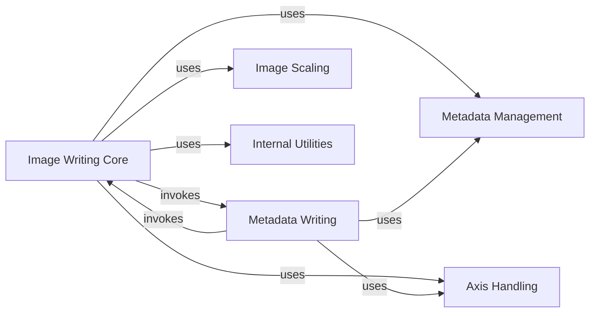

## Component Details

The OME-Zarr Writer subsystem is responsible for creating and writing OME-Zarr datasets, including multiscale images, plates, wells, and labels. Its main flow involves orchestrating the writing of image data, managing and validating metadata according to the OME-Zarr specification, and persisting both data and metadata to a Zarr store. It ensures data integrity and adherence to the OME-Zarr format for efficient storage and retrieval of biological image data.

### Image Writing Core

This component is responsible for the primary logic of writing image data to the Zarr store, handling both Dask arrays and standard arrays, and orchestrating the multiscale writing process. It acts as the main entry point for saving image data.

**Related Classes/Methods**:

- <a href="https://github.com/ome/ome-zarr-py/blob/master/ome_zarr/writer.py#L447-L537" target="_blank" rel="noopener noreferrer">`ome_zarr.writer.write_image` (447:537)</a>

- <a href="https://github.com/ome/ome-zarr-py/blob/master/ome_zarr/writer.py#L553-L649" target="_blank" rel="noopener noreferrer">`ome_zarr.writer._write_dask_image` (553:649)</a>

- <a href="https://github.com/ome/ome-zarr-py/blob/master/ome_zarr/writer.py#L898-L933" target="_blank" rel="noopener noreferrer">`ome_zarr.writer._create_mip` (898:933)</a>

- <a href="https://github.com/ome/ome-zarr-py/blob/master/ome_zarr/writer.py#L173-L293" target="_blank" rel="noopener noreferrer">`ome_zarr.writer.write_multiscale` (173:293)</a>

### Metadata Management

This component handles the generation and validation of various OME-Zarr metadata, including coordinate transformations, plate, well, and dataset structures. It ensures that the metadata adheres to the specified OME-Zarr format version.

**Related Classes/Methods**:

- <a href="https://github.com/ome/ome-zarr-py/blob/master/ome_zarr/format.py#L220-L342" target="_blank" rel="noopener noreferrer">`ome_zarr.format.FormatV04` (220:342)</a>

- <a href="https://github.com/ome/ome-zarr-py/blob/master/ome_zarr/format.py#L273-L342" target="_blank" rel="noopener noreferrer">`ome_zarr.format.FormatV04.validate_coordinate_transformations` (273:342)</a>

- <a href="https://github.com/ome/ome-zarr-py/blob/master/ome_zarr/format.py#L260-L271" target="_blank" rel="noopener noreferrer">`ome_zarr.format.FormatV04.generate_coordinate_transformations` (260:271)</a>

- <a href="https://github.com/ome/ome-zarr-py/blob/master/ome_zarr/format.py#L232-L242" target="_blank" rel="noopener noreferrer">`ome_zarr.format.FormatV04.generate_well_dict` (232:242)</a>

- <a href="https://github.com/ome/ome-zarr-py/blob/master/ome_zarr/format.py#L244-L258" target="_blank" rel="noopener noreferrer">`ome_zarr.format.FormatV04.validate_well_dict` (244:258)</a>

- <a href="https://github.com/ome/ome-zarr-py/blob/master/ome_zarr/writer.py#L130-L148" target="_blank" rel="noopener noreferrer">`ome_zarr.writer._validate_datasets` (130:148)</a>

- <a href="https://github.com/ome/ome-zarr-py/blob/master/ome_zarr/writer.py#L92-L113" target="_blank" rel="noopener noreferrer">`ome_zarr.writer._validate_plate_acquisitions` (92:113)</a>

- <a href="https://github.com/ome/ome-zarr-py/blob/master/ome_zarr/writer.py#L116-L127" target="_blank" rel="noopener noreferrer">`ome_zarr.writer._validate_plate_rows_columns` (116:127)</a>

- <a href="https://github.com/ome/ome-zarr-py/blob/master/ome_zarr/writer.py#L151-L170" target="_blank" rel="noopener noreferrer">`ome_zarr.writer._validate_plate_wells` (151:170)</a>

- <a href="https://github.com/ome/ome-zarr-py/blob/master/ome_zarr/writer.py#L66-L89" target="_blank" rel="noopener noreferrer">`ome_zarr.writer._validate_well_images` (66:89)</a>

### Metadata Writing

This component specifically deals with writing the generated OME-Zarr metadata (multiscale, plate, well, and label metadata) to the Zarr store, ensuring that the structural and descriptive information is correctly persisted alongside the image data.

**Related Classes/Methods**:

- <a href="https://github.com/ome/ome-zarr-py/blob/master/ome_zarr/writer.py#L296-L371" target="_blank" rel="noopener noreferrer">`ome_zarr.writer.write_multiscales_metadata` (296:371)</a>

- <a href="https://github.com/ome/ome-zarr-py/blob/master/ome_zarr/writer.py#L374-L419" target="_blank" rel="noopener noreferrer">`ome_zarr.writer.write_plate_metadata` (374:419)</a>

- <a href="https://github.com/ome/ome-zarr-py/blob/master/ome_zarr/writer.py#L422-L444" target="_blank" rel="noopener noreferrer">`ome_zarr.writer.write_well_metadata` (422:444)</a>

- <a href="https://github.com/ome/ome-zarr-py/blob/master/ome_zarr/writer.py#L652-L697" target="_blank" rel="noopener noreferrer">`ome_zarr.writer.write_label_metadata` (652:697)</a>

- <a href="https://github.com/ome/ome-zarr-py/blob/master/ome_zarr/writer.py#L700-L784" target="_blank" rel="noopener noreferrer">`ome_zarr.writer.write_multiscale_labels` (700:784)</a>

- <a href="https://github.com/ome/ome-zarr-py/blob/master/ome_zarr/writer.py#L787-L895" target="_blank" rel="noopener noreferrer">`ome_zarr.writer.write_labels` (787:895)</a>

### Image Scaling

This component provides functionality for downsampling and resizing image data, which is a crucial step in generating the multiscale representations required by the OME-Zarr specification for efficient data access at different resolutions.

**Related Classes/Methods**:

- <a href="https://github.com/ome/ome-zarr-py/blob/master/ome_zarr/scale.py#L10-L100" target="_blank" rel="noopener noreferrer">`ome_zarr.scale.Scaler` (10:100)</a>

- <a href="https://github.com/ome/ome-zarr-py/blob/master/ome_zarr/scale.py#L103-L112" target="_blank" rel="noopener noreferrer">`ome_zarr.scale.Scaler.resize_image` (103:112)</a>

### Axis Handling

This component is responsible for managing and validating image axes, ensuring that the axis information (names, types, units) conforms to the OME-Zarr specification and is correctly applied during image and metadata writing.

**Related Classes/Methods**:

- <a href="https://github.com/ome/ome-zarr-py/blob/master/ome_zarr/axes.py#L10-L100" target="_blank" rel="noopener noreferrer">`ome_zarr.axes.Axes` (10:100)</a>

- <a href="https://github.com/ome/ome-zarr-py/blob/master/ome_zarr/writer.py#L26-L63" target="_blank" rel="noopener noreferrer">`ome_zarr.writer._get_valid_axes` (26:63)</a>

### Internal Utilities

This component groups various helper functions that provide common utilities for the writer module, such as resolving storage options for Zarr arrays and restructuring data into appropriate tuple formats for processing.

**Related Classes/Methods**:

- <a href="https://github.com/ome/ome-zarr-py/blob/master/ome_zarr/writer.py#L540-L550" target="_blank" rel="noopener noreferrer">`ome_zarr.writer._resolve_storage_options` (540:550)</a>

- <a href="https://github.com/ome/ome-zarr-py/blob/master/ome_zarr/writer.py#L936-L951" target="_blank" rel="noopener noreferrer">`ome_zarr.writer._retuple` (936:951)</a>

### [FAQ](https://github.com/CodeBoarding/GeneratedOnBoardings/tree/main?tab=readme-ov-file#faq)