```mermaid

graph LR

    Core_I_O_and_Location_Management["Core I-O and Location Management"]

    OME_Zarr_Format_Specification["OME-Zarr Format Specification"]

    OME_Zarr_Reader["OME-Zarr Reader"]

    OME_Zarr_Writer["OME-Zarr Writer"]

    Image_Processing_Scaling["Image Processing & Scaling"]

    CLI_General_Utilities["CLI & General Utilities"]

    Data_Generation_Conversion["Data Generation & Conversion"]

    OME_Zarr_Metadata_Axis_Management["OME-Zarr Metadata & Axis Management"]

    Core_I_O_and_Location_Management -- "initializes with" --> OME_Zarr_Format_Specification

    Core_I_O_and_Location_Management -- "uses" --> OME_Zarr_Format_Specification

    OME_Zarr_Reader -- "reads from" --> Core_I_O_and_Location_Management

    OME_Zarr_Reader -- "interprets format via" --> OME_Zarr_Format_Specification

    OME_Zarr_Writer -- "writes to" --> Core_I_O_and_Location_Management

    OME_Zarr_Writer -- "validates with" --> OME_Zarr_Format_Specification

    OME_Zarr_Writer -- "uses for axis validation" --> OME_Zarr_Metadata_Axis_Management

    Image_Processing_Scaling -- "processes data for" --> OME_Zarr_Writer

    Image_Processing_Scaling -- "interacts with" --> Core_I_O_and_Location_Management

    CLI_General_Utilities -- "utilizes" --> Core_I_O_and_Location_Management

    CLI_General_Utilities -- "orchestrates" --> OME_Zarr_Reader

    CLI_General_Utilities -- "orchestrates" --> OME_Zarr_Writer

    CLI_General_Utilities -- "orchestrates" --> Image_Processing_Scaling

    CLI_General_Utilities -- "orchestrates" --> Data_Generation_Conversion

    Data_Generation_Conversion -- "generates data for" --> OME_Zarr_Writer

    Data_Generation_Conversion -- "uses for path handling" --> Core_I_O_and_Location_Management

    OME_Zarr_Metadata_Axis_Management -- "provides validation rules to" --> OME_Zarr_Format_Specification

    click Core_I_O_and_Location_Management href "https://github.com/ome/ome-zarr-py/blob/main/.codeboarding//Core I-O and Location Management.md" "Details"

    click OME_Zarr_Format_Specification href "https://github.com/ome/ome-zarr-py/blob/main/.codeboarding//OME-Zarr Format Specification.md" "Details"

    click OME_Zarr_Reader href "https://github.com/ome/ome-zarr-py/blob/main/.codeboarding//OME-Zarr Reader.md" "Details"

    click OME_Zarr_Writer href "https://github.com/ome/ome-zarr-py/blob/main/.codeboarding//OME-Zarr Writer.md" "Details"

    click Image_Processing_Scaling href "https://github.com/ome/ome-zarr-py/blob/main/.codeboarding//Image Processing & Scaling.md" "Details"

    click CLI_General_Utilities href "https://github.com/ome/ome-zarr-py/blob/main/.codeboarding//CLI & General Utilities.md" "Details"

    click Data_Generation_Conversion href "https://github.com/ome/ome-zarr-py/blob/main/.codeboarding//Data Generation & Conversion.md" "Details"

    click OME_Zarr_Metadata_Axis_Management href "https://github.com/ome/ome-zarr-py/blob/main/.codeboarding//OME-Zarr Metadata & Axis Management.md" "Details"

```

## Component Details

The `ome-zarr-py` project provides a comprehensive library for interacting with OME-Zarr datasets, which are used for storing and managing large-scale biological image data. The main flow involves reading, writing, and processing OME-Zarr data, with support for different format versions, multiscale representations, and command-line utilities for common tasks. It abstracts underlying storage mechanisms and ensures data integrity through metadata and axis management.

### Core I-O and Location Management

This component handles low-level interactions with Zarr stores, including path resolution, store initialization (using FSStore), and basic metadata existence checks (.zarray, .zgroup, .zattrs). It provides the foundational layer for reading from and writing to OME-Zarr datasets, abstracting the underlying storage (local file system, HTTP).

**Related Classes/Methods**:

- <a href="https://github.com/ome/ome-zarr-py/blob/master/ome_zarr/io.py#L20-L205" target="_blank" rel="noopener noreferrer">`ome_zarr.io.ZarrLocation` (20:205)</a>

- <a href="https://github.com/ome/ome-zarr-py/blob/master/ome_zarr/io.py#L208-L232" target="_blank" rel="noopener noreferrer">`ome_zarr.io.parse_url` (208:232)</a>

### OME-Zarr Format Specification

This component defines and manages the different versions of the OME-Zarr specification (V01, V02, V03, V04). It includes functionalities for detecting the format version of a Zarr store, validating metadata against specific format rules, and generating format-specific metadata structures like coordinate transformations and well dictionaries.

**Related Classes/Methods**:

- <a href="https://github.com/ome/ome-zarr-py/blob/master/ome_zarr/format.py#L47-L117" target="_blank" rel="noopener noreferrer">`ome_zarr.format.Format` (47:117)</a>

- <a href="https://github.com/ome/ome-zarr-py/blob/master/ome_zarr/format.py#L120-L170" target="_blank" rel="noopener noreferrer">`ome_zarr.format.FormatV01` (120:170)</a>

- <a href="https://github.com/ome/ome-zarr-py/blob/master/ome_zarr/format.py#L173-L206" target="_blank" rel="noopener noreferrer">`ome_zarr.format.FormatV02` (173:206)</a>

- <a href="https://github.com/ome/ome-zarr-py/blob/master/ome_zarr/format.py#L209-L217" target="_blank" rel="noopener noreferrer">`ome_zarr.format.FormatV03` (209:217)</a>

- <a href="https://github.com/ome/ome-zarr-py/blob/master/ome_zarr/format.py#L220-L342" target="_blank" rel="noopener noreferrer">`ome_zarr.format.FormatV04` (220:342)</a>

- <a href="https://github.com/ome/ome-zarr-py/blob/master/ome_zarr/format.py#L33-L44" target="_blank" rel="noopener noreferrer">`ome_zarr.format.detect_format` (33:44)</a>

- <a href="https://github.com/ome/ome-zarr-py/blob/master/ome_zarr/format.py#L12-L20" target="_blank" rel="noopener noreferrer">`ome_zarr.format.format_from_version` (12:20)</a>

### OME-Zarr Reader

Responsible for reading and interpreting the complex metadata and data structures within OME-Zarr datasets. It provides classes for navigating the Zarr hierarchy, identifying different types of nodes (e.g., labels, multiscales, plates, wells), and accessing their associated data and metadata.

**Related Classes/Methods**:

- <a href="https://github.com/ome/ome-zarr-py/blob/master/ome_zarr/reader.py#L19-L156" target="_blank" rel="noopener noreferrer">`ome_zarr.reader.Node` (19:156)</a>

- <a href="https://github.com/ome/ome-zarr-py/blob/master/ome_zarr/reader.py#L609-L649" target="_blank" rel="noopener noreferrer">`ome_zarr.reader.Reader` (609:649)</a>

- <a href="https://github.com/ome/ome-zarr-py/blob/master/ome_zarr/reader.py#L467-L561" target="_blank" rel="noopener noreferrer">`ome_zarr.reader.Plate` (467:561)</a>

- <a href="https://github.com/ome/ome-zarr-py/blob/master/ome_zarr/reader.py#L396-L464" target="_blank" rel="noopener noreferrer">`ome_zarr.reader.Well` (396:464)</a>

- <a href="https://github.com/ome/ome-zarr-py/blob/master/ome_zarr/reader.py#L269-L324" target="_blank" rel="noopener noreferrer">`ome_zarr.reader.Multiscales` (269:324)</a>

- <a href="https://github.com/ome/ome-zarr-py/blob/master/ome_zarr/reader.py#L182-L198" target="_blank" rel="noopener noreferrer">`ome_zarr.reader.Labels` (182:198)</a>

### OME-Zarr Writer

Handles the creation and writing of OME-Zarr datasets, including multiscale images, plates, wells, and labels. It ensures that data and metadata conform to the OME-Zarr specification and manages the storage of image data.

**Related Classes/Methods**:

- <a href="https://github.com/ome/ome-zarr-py/blob/master/ome_zarr/writer.py#L173-L293" target="_blank" rel="noopener noreferrer">`ome_zarr.writer.write_multiscale` (173:293)</a>

- <a href="https://github.com/ome/ome-zarr-py/blob/master/ome_zarr/writer.py#L447-L537" target="_blank" rel="noopener noreferrer">`ome_zarr.writer.write_image` (447:537)</a>

- <a href="https://github.com/ome/ome-zarr-py/blob/master/ome_zarr/writer.py#L787-L895" target="_blank" rel="noopener noreferrer">`ome_zarr.writer.write_labels` (787:895)</a>

- <a href="https://github.com/ome/ome-zarr-py/blob/master/ome_zarr/writer.py#L296-L371" target="_blank" rel="noopener noreferrer">`ome_zarr.writer.write_multiscales_metadata` (296:371)</a>

- <a href="https://github.com/ome/ome-zarr-py/blob/master/ome_zarr/writer.py#L374-L419" target="_blank" rel="noopener noreferrer">`ome_zarr.writer.write_plate_metadata` (374:419)</a>

- <a href="https://github.com/ome/ome-zarr-py/blob/master/ome_zarr/writer.py#L422-L444" target="_blank" rel="noopener noreferrer">`ome_zarr.writer.write_well_metadata` (422:444)</a>

- <a href="https://github.com/ome/ome-zarr-py/blob/master/ome_zarr/writer.py#L652-L697" target="_blank" rel="noopener noreferrer">`ome_zarr.writer.write_label_metadata` (652:697)</a>

### Image Processing & Scaling

Provides functionalities for scaling and processing image data within OME-Zarr datasets. It includes methods for resizing images using different interpolation techniques and managing the creation of multiscale representations.

**Related Classes/Methods**:

- <a href="https://github.com/ome/ome-zarr-py/blob/master/ome_zarr/scale.py#L19-L170" target="_blank" rel="noopener noreferrer">`ome_zarr.scale.Scaler` (19:170)</a>

- <a href="https://github.com/ome/ome-zarr-py/blob/master/ome_zarr/dask_utils.py#L10-L61" target="_blank" rel="noopener noreferrer">`ome_zarr.dask_utils.resize` (10:61)</a>

### CLI & General Utilities

Offers command-line utilities for interacting with OME-Zarr datasets and provides a collection of general-purpose helper functions. These include tools for displaying information, viewing data, finding specific datasets, downloading data, and various file path manipulations.

**Related Classes/Methods**:

- <a href="https://github.com/ome/ome-zarr-py/blob/master/ome_zarr/cli.py#L89-L204" target="_blank" rel="noopener noreferrer">`ome_zarr.cli.main` (89:204)</a>

- <a href="https://github.com/ome/ome-zarr-py/blob/master/ome_zarr/cli.py#L27-L30" target="_blank" rel="noopener noreferrer">`ome_zarr.cli.info` (27:30)</a>

- <a href="https://github.com/ome/ome-zarr-py/blob/master/ome_zarr/cli.py#L33-L36" target="_blank" rel="noopener noreferrer">`ome_zarr.cli.view` (33:36)</a>

- <a href="https://github.com/ome/ome-zarr-py/blob/master/ome_zarr/cli.py#L39-L42" target="_blank" rel="noopener noreferrer">`ome_zarr.cli.finder` (39:42)</a>

- <a href="https://github.com/ome/ome-zarr-py/blob/master/ome_zarr/cli.py#L45-L48" target="_blank" rel="noopener noreferrer">`ome_zarr.cli.download` (45:48)</a>

- <a href="https://github.com/ome/ome-zarr-py/blob/master/ome_zarr/cli.py#L51-L65" target="_blank" rel="noopener noreferrer">`ome_zarr.cli.create` (51:65)</a>

- <a href="https://github.com/ome/ome-zarr-py/blob/master/ome_zarr/cli.py#L68-L78" target="_blank" rel="noopener noreferrer">`ome_zarr.cli.scale` (68:78)</a>

- <a href="https://github.com/ome/ome-zarr-py/blob/master/ome_zarr/cli.py#L81-L86" target="_blank" rel="noopener noreferrer">`ome_zarr.cli.csv_to_labels` (81:86)</a>

- <a href="https://github.com/ome/ome-zarr-py/blob/master/ome_zarr/utils.py#L117-L173" target="_blank" rel="noopener noreferrer">`ome_zarr.utils.find_multiscales` (117:173)</a>

- <a href="https://github.com/ome/ome-zarr-py/blob/master/ome_zarr/utils.py#L176-L190" target="_blank" rel="noopener noreferrer">`ome_zarr.utils.splitall` (176:190)</a>

- <a href="https://github.com/ome/ome-zarr-py/blob/master/ome_zarr/utils.py#L350-L382" target="_blank" rel="noopener noreferrer">`ome_zarr.utils.strip_common_prefix` (350:382)</a>

### Data Generation & Conversion

Contains functions for generating sample OME-Zarr datasets (e.g., astronaut images, circles) for testing and demonstration, and provides utilities for converting external data formats, specifically CSV, into OME-Zarr labels.

**Related Classes/Methods**:

- <a href="https://github.com/ome/ome-zarr-py/blob/master/ome_zarr/data.py#L47-L75" target="_blank" rel="noopener noreferrer">`ome_zarr.data.astronaut` (47:75)</a>

- <a href="https://github.com/ome/ome-zarr-py/blob/master/ome_zarr/data.py#L119-L223" target="_blank" rel="noopener noreferrer">`ome_zarr.data.create_zarr` (119:223)</a>

- <a href="https://github.com/ome/ome-zarr-py/blob/master/ome_zarr/data.py#L22-L44" target="_blank" rel="noopener noreferrer">`ome_zarr.data.coins` (22:44)</a>

- <a href="https://github.com/ome/ome-zarr-py/blob/master/ome_zarr/data.py#L78-L102" target="_blank" rel="noopener noreferrer">`ome_zarr.data.make_circle` (78:102)</a>

- <a href="https://github.com/ome/ome-zarr-py/blob/master/ome_zarr/data.py#L105-L116" target="_blank" rel="noopener noreferrer">`ome_zarr.data.rgb_to_5d` (105:116)</a>

- <a href="https://github.com/ome/ome-zarr-py/blob/master/ome_zarr/csv.py#L29-L87" target="_blank" rel="noopener noreferrer">`ome_zarr.csv.csv_to_zarr` (29:87)</a>

- <a href="https://github.com/ome/ome-zarr-py/blob/master/ome_zarr/csv.py#L14-L26" target="_blank" rel="noopener noreferrer">`ome_zarr.csv.parse_csv_value` (14:26)</a>

- <a href="https://github.com/ome/ome-zarr-py/blob/master/ome_zarr/csv.py#L90-L140" target="_blank" rel="noopener noreferrer">`ome_zarr.csv.dict_to_zarr` (90:140)</a>

### OME-Zarr Metadata & Axis Management

Manages the internal representation, validation, and generation of OME-Zarr metadata structures, including image axes and coordinate transformations. It ensures that dimensional information and transformations adhere to the OME-Zarr specification.

**Related Classes/Methods**:

- <a href="https://github.com/ome/ome-zarr-py/blob/master/ome_zarr/axes.py#L10-L100" target="_blank" rel="noopener noreferrer">`ome_zarr.axes.Axes` (10:100)</a>

### [FAQ](https://github.com/CodeBoarding/GeneratedOnBoardings/tree/main?tab=readme-ov-file#faq)